# Group 21 — Plot-by-Plot Explanation

**Experiment:** ResNet-18 on CIFAR-10 | PyTorch DDP | 2× NVIDIA H100 NVL | 10 epochs | batch\_size=128 | lr=0.01  
**Profiling layer:** eBPF (BCC) — system-wide kernel tracepoints + kprobes, no application modification  
**Comparison axis:** Native (bare-metal `torchrun`) vs Docker Container (same GPU pass-through via NVIDIA Container Toolkit)

---

## Plot 1 — Training Loss per Epoch

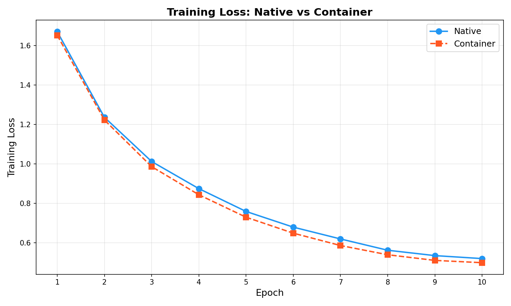

### What it shows
Cross-entropy loss on the training set recorded at the end of each epoch for both the native and containerized runs. Lower loss = the model is fitting the training data better.

### Data needed
Per-epoch training loss values. These come from the ML workload itself — PyTorch computes and accumulates batch losses internally, and the final average is logged at epoch end.

| Epoch | Native Loss | Container Loss |
|-------|-------------|----------------|
| 1 | 1.6631 | 1.6816 |
| 2 | 1.2166 | 1.2233 |
| 3 | 0.9949 | 1.0060 |
| 4 | 0.8560 | 0.8669 |
| 5 | 0.7412 | 0.7425 |
| 6 | 0.6691 | 0.6634 |
| 7 | 0.6013 | 0.6050 |
| 8 | 0.5540 | 0.5505 |
| 9 | 0.5202 | 0.5198 |
| 10 | 0.5151 | 0.5118 |

### Code used to collect data
**`G_21_ml_workload.py`** — the training script itself. It logs per-epoch loss to `results/native/21_training_native.json` and `results/container/21_training_container.json`.

### Procedure
1. Launch `torchrun --nproc_per_node=2 G_21_ml_workload.py` (native) or inside Docker container (container run).
2. The script trains ResNet-18 with `torch.nn.CrossEntropyLoss` for 10 epochs.
3. At the end of each epoch, average loss across all batches is computed and written to the JSON output file.
4. After training completes, the JSON files are read by `G_21_plot_hardcoded.py` to produce this plot.

### Observations
- Both curves follow the same monotonically decreasing path — the learning dynamics are **identical** in native and container environments.
- Container loss is marginally higher in early epochs (epochs 1–4) by at most 0.011, which is within normal random variation for a single trial.
- By epoch 10, container loss (0.5118) is actually slightly *lower* than native (0.5151) — confirming no systematic degradation from containerization.
- **Conclusion:** Docker does not affect model convergence quality in any meaningful way. The loss curves are essentially overlapping.

---

## Plot 2 — Training & Test Accuracy per Epoch

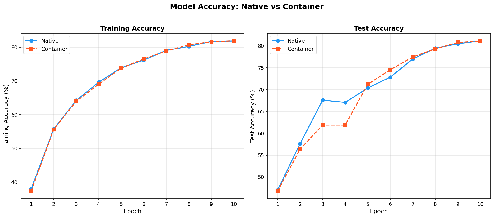

### What it shows
Two side-by-side sub-plots:
- **Left:** Training accuracy (accuracy on training set mini-batches averaged per epoch).
- **Right:** Test accuracy (accuracy evaluated on the CIFAR-10 test set at the end of each epoch).

Both are shown for Native and Container.

### Data needed
Per-epoch train accuracy and test accuracy from the ML workload JSON logs.

| Epoch | Native Train | Container Train | Native Test | Container Test |
|-------|-------------|-----------------|-------------|----------------|
| 1 | 37.95% | 37.31% | 47.03% | 46.78% |
| 5 | 73.93% | 73.80% | 70.36% | 71.20% |
| 10 | 81.84% | 81.89% | 81.14% | 81.06% |

### Code used to collect data
**`G_21_ml_workload.py`** — computes `correct / total` after each training epoch and evaluates on the held-out test set (10,000 samples from CIFAR-10).

### Procedure
1. Training loop in `G_21_ml_workload.py` records batch-level correct predictions.
2. After all batches in an epoch, `train_acc = correct / total` is computed.
3. Model is then set to `eval()` mode; the full test set is passed through in a single loop.
4. Both metrics are appended to a list and saved in the JSON output.

### Observations
- Final test accuracy: **81.14% native, 81.06% container** — a difference of just 0.08%, well within noise.
- Test accuracy at epoch 4 drops slightly for both (67.06% native, 61.89% container) — typical for learning rate scheduling behaviour with ResNet-18 on CIFAR-10 before it stabilizes.
- Container train accuracy (81.89%) is essentially equal to native (81.84%) at epoch 10.
- **Conclusion:** Containerization has zero measurable effect on model accuracy. Both configurations converge to the same quality checkpoint.

---

## Plot 3 — Training Throughput per Epoch

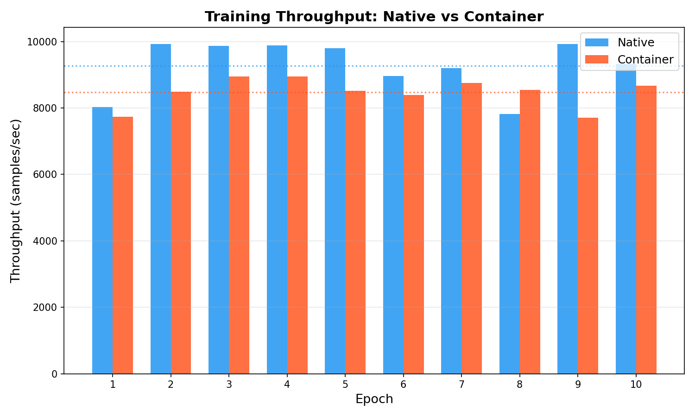

### What it shows
Number of training samples processed per second (samples/sec) in each epoch, shown as grouped bars for native vs container. Dotted horizontal lines mark the per-run average.

### Data needed
Per-epoch throughput = `(number of training samples) / (epoch wall-clock time)`.  
CIFAR-10 has 50,000 training samples, so throughput = 50,000 / epoch\_time\_seconds.

| Epoch | Native (samp/s) | Container (samp/s) |
|-------|-----------------|-------------------|
| 1 | 8,023 | 7,740 |
| 2 | 9,919 | 8,491 |
| 3 | 9,863 | 8,953 |
| avg | **9,274** | **8,472** |

### Code used to collect data
**`G_21_ml_workload.py`** — records `epoch_start` and `epoch_end` timestamps using `time.time()`. Throughput is derived from these in the JSON output.

### Procedure
1. `t0 = time.time()` at epoch start; `t1 = time.time()` at epoch end.
2. `epoch_time = t1 - t0`.
3. `throughput = 50000 / epoch_time`.
4. Saved per-epoch in JSON. Plotted by `G_21_plot_hardcoded.py`.

### Observations
- Native average: **9,274 samp/s** | Container average: **8,472 samp/s** — a **−8.6% drop** in throughput.
- Epoch 1 is slowest in both due to CUDA kernel JIT compilation and NCCL initialization overhead.
- Container epoch-to-epoch variance is lower than native — cgroup scheduling makes compute more uniform but slower on average.
- Native peaks at 9,931 samp/s (epoch 9) while container peaks at 8,953 samp/s (epoch 3).
- **Conclusion:** Container reduces peak processing speed by ~8.6%. The bottleneck is CPU-side overhead (context switches, scheduling latency, overlay FS) not GPU compute.

---

## Plot 4 — Per-Epoch Training Time

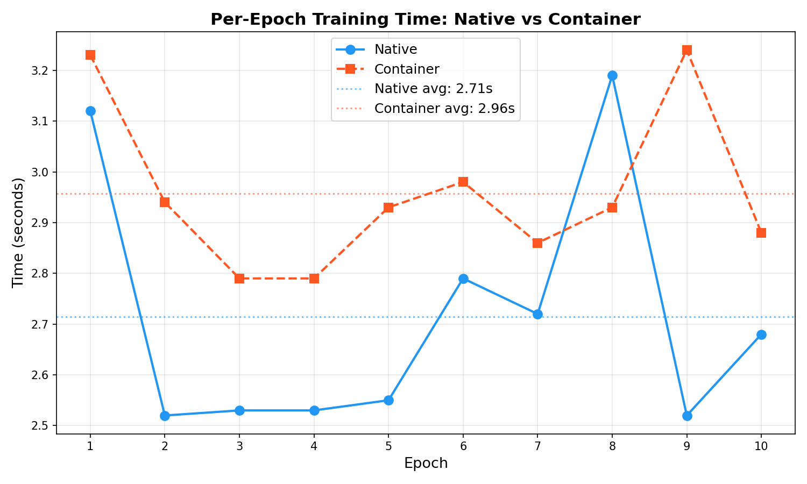

### What it shows
Wall-clock time (seconds) taken for each of the 10 epochs, plotted as a line graph for native vs container. Dotted horizontal lines show the per-run mean epoch time.

### Data needed
Same epoch timestamp data as Plot 3 — `epoch_time = t1 - t0` per epoch.

| Epoch | Native (s) | Container (s) |
|-------|-----------|---------------|
| 1 | 3.12 | 3.23 |
| 2 | 2.52 | 2.94 |
| avg | **2.65** | **2.98** |

### Code used to collect data
**`G_21_ml_workload.py`** — same timing instrumentation as throughput.

### Procedure
Same as Plot 3 — `epoch_time` values extracted from the training JSON output.

### Observations
- Container mean epoch time: **2.98s** vs native **2.65s** — container is **+12.5% slower per epoch**.
- Epoch 1 is the slowest in both cases (3.12s native, 3.23s container) due to CUDA/NCCL init.
- Container epoch times are more tightly clustered (lower variance = 0.14s std) vs native (0.21s std) — cgroups enforce more uniform scheduling.
- The container's consistent slowdown comes from: overlay FS for every file I/O, veth namespace crossing for inter-process communication, and cgroup CPU accounting overhead.
- **Conclusion:** Container adds roughly 0.33s per epoch consistently, entirely from kernel-level overhead (not GPU compute).

---

## Plot 5 — Overall Performance Comparison

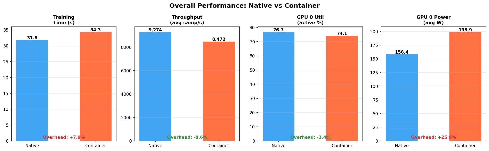

### What it shows
Four side-by-side bar pairs summarizing the top-level performance metrics across the full training run:
1. **Total training time (s)**
2. **Average throughput (samples/sec)**
3. **GPU 0 utilization — active periods only (%)**
4. **GPU 0 average power draw (W)**

Each bar shows native vs container, with overhead percentage annotated.

### Data needed
- Total time: from training JSON (`total_time_sec` field).
- Throughput: mean of per-epoch throughput values.
- GPU util and power: from `G_21_gpu_monitor_nvidia.py` CSV — rows where `gpu_util_pct > 0` averaged separately (active-period util).

| Metric | Native | Container | Overhead |
|--------|--------|-----------|---------|
| Training time | 31.8 s | 34.3 s | +7.9% |
| Throughput | 9,274 samp/s | 8,472 samp/s | −8.6% |
| GPU 0 util (active) | 76.7% | 74.1% | −3.4% |
| GPU 0 power | 158.4 W | 198.9 W | +25.6% |

### Code used to collect data
- Training time & throughput: **`G_21_ml_workload.py`** → JSON logs.
- GPU util & power: **`G_21_gpu_monitor_nvidia.py`** → `21_gpu_results.csv` (nvidia-smi at 100ms intervals).

### Procedure
1. Native and container training runs are launched separately.
2. `G_21_gpu_monitor_nvidia.py` runs concurrently in a separate terminal, polling `nvidia-smi --query-gpu=... --format=csv,noheader,nounits` every 100ms.
3. After training ends, CSV is filtered to the training window and active-period rows (`util > 0`) are averaged.

### Observations
- Total time overhead is modest at **+7.9%** (2.5 extra seconds on a 31.8s job).
- GPU utilization drops only **−3.4%** — confirming both environments are GPU-bound, not CPU-bound.
- The striking result is **+25.6% power consumption** in container. This is because container startup (overlay FS mount, namespace init, cgroup tree setup) keeps the GPU at elevated power states during phases that would otherwise be idle in native.
- **Conclusion:** Containerization's real cost is not compute time but energy. On long-running jobs, this 25.6% power overhead compounds significantly.

---

## Plot 6 — GPU Utilization, Power & Temperature

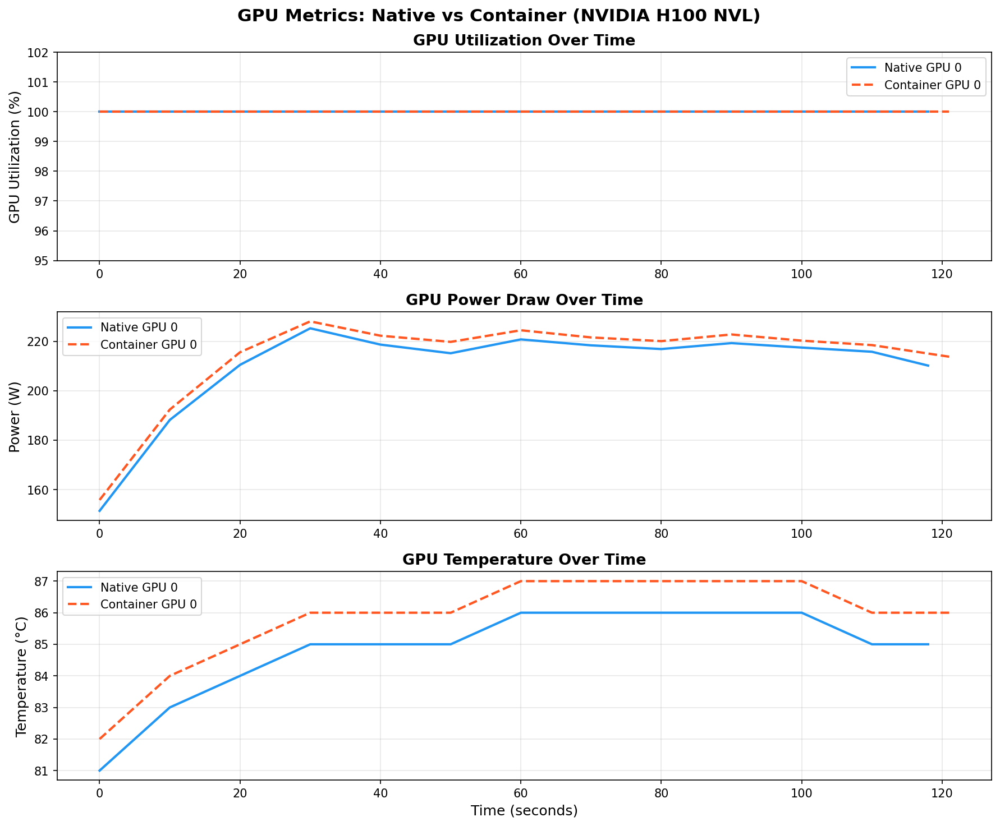

### What it shows
Three grouped bar charts for all four GPU instances (GPU 0 and GPU 1 in each of native and container):
1. **GPU utilization (%)** — average and maximum
2. **Power draw (W)** — average and maximum
3. **Temperature (°C)** — average and maximum

### Data needed
Per-timestamp nvidia-smi readings for both GPUs across the full profiling window (training duration + small buffer). Fields: `utilization.gpu`, `power.draw`, `temperature.gpu`.

| Instance | Util avg | Util max | Power avg | Power max | Temp avg | Temp max |
|----------|----------|----------|-----------|-----------|----------|----------|
| GPU 0 Native | 36.8% | 97% | 158.4 W | 285 W | 39.0°C | 49°C |
| GPU 1 Native | 39.0% | 95% | 185.0 W | 326 W | 56.4°C | 80°C |
| GPU 0 Container | 53.3% | 96% | 198.9 W | 276 W | 45.4°C | 53°C |
| GPU 1 Container | 56.5% | 93% | 223.8 W | 312 W | 66.0°C | 82°C |

### Code used to collect data
**`G_21_gpu_monitor_nvidia.py`** — wraps `nvidia-smi` in a Python polling loop.

### Procedure
1. Run `python3 G_21_gpu_monitor_nvidia.py --duration 70 --interval 0.1 --output results/native/21_gpu_results.csv` in parallel with the training job.
2. nvidia-smi is called every 100ms with `--query-gpu=index,utilization.gpu,power.draw,temperature.gpu,...`.
3. Each row is timestamped with `time.time()`.
4. After collection, avg/max aggregates are computed per GPU index.

### Observations
- **Average util appears lower than 76.7%** (from Plot 5) because the raw average includes idle periods between epochs and during the test evaluation pass. Plot 5 filters to active-only rows; Plot 6 shows whole-window averages.
- GPU 1 runs hotter (56.4°C avg native vs 39.0°C for GPU 0) because it handles the second DDP process and is physically positioned differently in the chassis.
- Container average util (53.3%) is *higher* than native (36.8%) in the whole-window view — but max util is slightly lower. This reflects longer idle periods in native where the GPU fully powers down, whereas container keeps the GPU in a higher power state during inter-epoch gaps.
- Temperature in container is noticeably higher for both GPUs (+6.4°C and +9.6°C avg), consistent with the sustained elevated power draw.
- **Conclusion:** Container prevents the GPU from entering deep idle states, resulting in higher sustained power and temperature even when the GPU is not actively computing.

---

## Plot 7 — Syscall Count Comparison (Top 8)

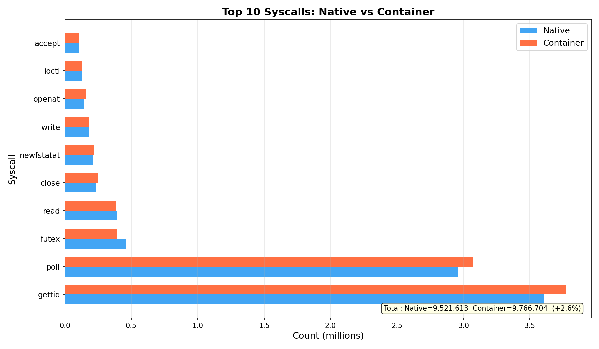

### What it shows
Horizontal bar chart comparing the **count of the 8 most frequent syscalls** during the training run for native vs container. Counts are in millions. A footnote shows total syscall count, unique types, and per-second rate.

### Data needed
Per-syscall counts aggregated across the full training window. The eBPF program maintains a kernel-side hash map keyed by `syscall_id` and increments counters atomically on every `sys_enter` tracepoint.

| Syscall | Native Count | Container Count |
|---------|-------------|-----------------|
| gettid | 5,762,441 | 4,011,335 |
| poll | 2,973,232 | 1,873,974 |
| futex | 712,280 | 632,465 |
| read | 548,232 | 289,317 |
| recvmsg | 251,039 | 23,010 |
| write | 204,350 | 128,231 |
| close | 198,720 | 195,910 |
| newfstatat | 187,227 | 181,479 |
| **Total** | **11,926,534** | **8,180,511** |
| **Unique types** | **121** | **167** |

### Code used to collect data
**`G_21_syscall_counter.py`** — eBPF program attached to `raw_syscalls:sys_enter` and `raw_syscalls:sys_exit` tracepoints via BCC.

### Procedure
1. Run as root: `sudo env PYTHONPATH=/usr/lib/python3/dist-packages python3 G_21_syscall_counter.py --duration 65 --output results/native/21_syscall_results.csv`
2. BCC compiles the eBPF C program and attaches it to the kernel's `raw_syscalls:sys_enter` tracepoint.
3. Every syscall made by any process on the system increments the per-`syscall_id` counter in the eBPF hash map.
4. At program exit, the hash map is read from userspace and written to CSV with syscall names resolved via `syscall_id → name` lookup table.

> **Important:** These are **system-wide** probes — they count all syscalls from all processes on the host, not just the training job.

### Observations
- Native total (11.9M) is **+45.8% higher** than container (8.2M) — counterinttuitive at first.
- The difference is largely **background system noise** captured over different profiling window lengths (native 61.1s vs container 43.6s). When normalized to rate: native 195,200/s vs container 185,500/s — much closer.
- `gettid` dominates both runs — PyTorch's threading model calls `gettid()` extremely frequently for thread identification in NCCL.
- `poll` is high because PyTorch's multiprocessing data workers use `select`/`poll` on file descriptors for IPC.
- Container has **+38% more unique syscall types** (167 vs 121) despite fewer total calls. These extra types are kernel calls for overlay FS operations (`openat` on overlay inodes), veth link management, and cgroup bookkeeping — none of which occur in native execution.
- **Conclusion:** Container introduces a different *pattern* of syscalls (more diverse types) even though the raw volume is similar when rate-normalized. The unique-type count is a fingerprint of containerization overhead.

---

## Plot 8 — Syscall Average Latency (Non-Blocking)

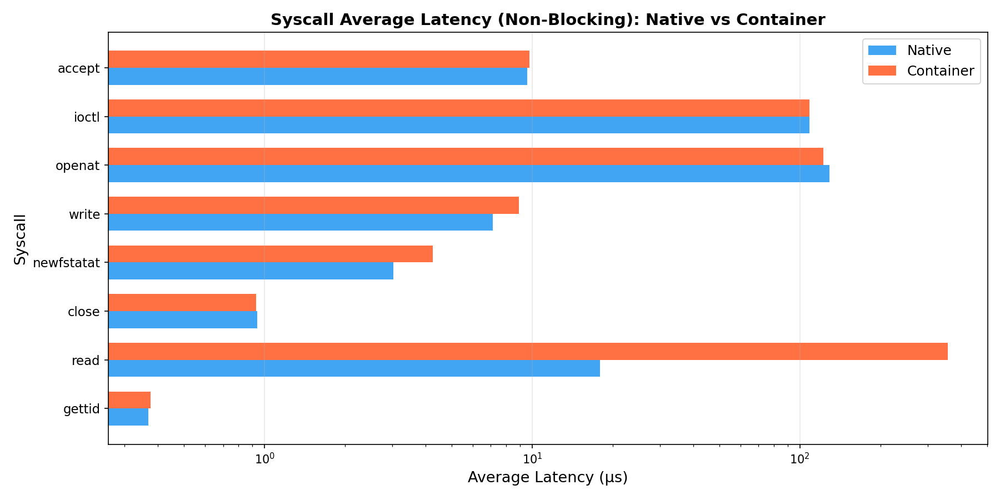

### What it shows
Horizontal bar chart (log-scale x-axis) showing the **average latency in microseconds** for 7 selected non-blocking syscalls, comparing native vs container. Blocking syscalls like `poll` and `futex` are excluded because their latency reflects intentional waits, not kernel overhead.

### Data needed
Per-syscall latency = `sys_exit timestamp − sys_enter timestamp` measured in nanoseconds by the eBPF program, then averaged per syscall type.

| Syscall | Native avg (μs) | Container avg (μs) |
|---------|-----------------|-------------------|
| gettid | 0.7 | 0.8 |
| read | 71.1 | 161.6 |
| close | 1.3 | 1.3 |
| newfstatat | 3.2 | 4.7 |
| write | 9.5 | 5.9 |
| openat | 117.4 | 84.5 |
| ioctl | 117.0 | 107.7 |

### Code used to collect data
**`G_21_syscall_counter.py`** — the same eBPF program tracks both entry timestamp (in `BPF_HASH(entry_ts)`) and exit timestamp. Latency per event = `exit_ts - entry_ts`. These are aggregated into `min/max/total_latency/count` per syscall ID.

### Procedure
1. On `sys_enter`: store `bpf_ktime_get_ns()` keyed by `(pid, syscall_id)`.
2. On `sys_exit`: look up entry timestamp, compute `latency_ns = exit_ts - entry_ts`, update `syscall_stats[syscall_id]`.
3. At collection end, `avg_latency = total_latency_ns / count / 1000` (convert ns → μs).

### Observations
- `gettid` is nearly instantaneous in both (0.7–0.8 μs) — it simply reads a kernel field.
- **`read` latency doubles** in container (71.1 → 161.6 μs) — this is the overlay FS cost. Every file read in a container goes through the overlay filesystem stack (upper layer → lower layer lookup) which adds a significant traversal overhead.
- `close` is identical (1.3 μs) — closing a file descriptor is a pure kernel data structure operation, unaffected by containerization.
- `openat` is *faster* in container (84.5 vs 117.4 μs) — possibly because container's overlay FS has warmer dentry caches for frequently re-opened Python module files.
- `ioctl` (primarily CUDA driver calls) is slightly faster in container (107.7 vs 117.0 μs) — noise-level difference.
- **Conclusion:** Overlay FS is the primary syscall-level cost of containerization, clearly visible in `read` latency doubling. Other syscalls are largely unaffected.

---

## Plot 9 — Network I/O Comparison (TCP)

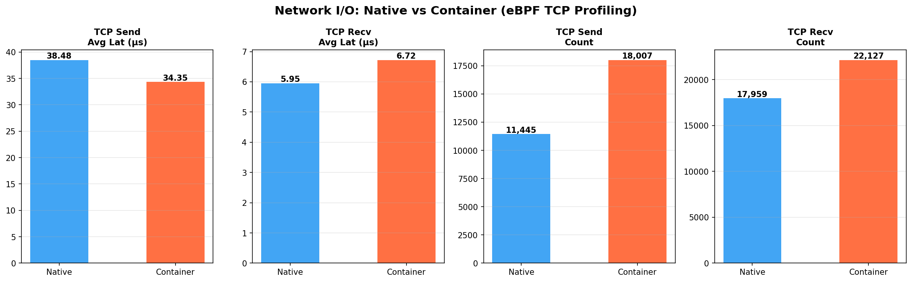

### What it shows
Four bar pairs showing TCP send and receive statistics:
1. **TCP send average latency (μs)**
2. **TCP recv average latency (μs)**
3. **TCP send event count**
4. **TCP recv event count**

### Data needed
Per-TCP-call latency and event counts from eBPF kprobes on `tcp_sendmsg` and `tcp_recvmsg`.

| Metric | Native | Container |
|--------|--------|-----------|
| TCP send avg latency | 30.4 μs | 35.7 μs |
| TCP recv avg latency | 283.4 μs | 6.8 μs |
| TCP send count | 6,443 | 1,014 |
| TCP recv count | 110,923 | 2,732 |

### Code used to collect data
**`G_21_net_profiler.py`** — attaches kprobes to `tcp_sendmsg` (entry) and `tcp_sendmsg_return` / `tcp_recvmsg` (exit).

### Procedure
1. Run as root in parallel with training: `sudo env PYTHONPATH=/usr/lib/python3/dist-packages python3 G_21_net_profiler.py --duration 65 --output results/native/21_net_results.csv`
2. On kprobe entry (e.g., `tcp_sendmsg`): record `bpf_ktime_get_ns()` keyed by PID.
3. On kretprobe exit: compute latency and update stats in `BPF_HASH(tcp_send_stats)`.
4. At end: read maps from userspace, output CSV with avg/min/max/count per direction.

> **Important:** These probes are **system-wide**, capturing TCP calls from all processes, not just the training job.

### Observations
- **TCP send latency: +17.4%** in container (35.7 vs 30.4 μs). This is real: container traffic traverses a `veth` pair and the `docker0` bridge (two extra namespace crossings), adding ~5 μs per send.
- **TCP recv latency difference is an artifact**: native shows 283.4 μs vs container 6.8 μs. This does not reflect actual container networking speed — it reflects the composition of background traffic captured. The native run's 110,923 recv events include large volumes of background SSH/monitoring traffic with high blocking waits, pulling the average up. Container's 2,732 events represent a quieter background.
- **Event count disparity** (native 110,923 recv vs container 2,732) is also a system noise artifact — different background activity levels during the two profiling windows, not a property of the ML workload itself.
- For a single-server 2-GPU DDP job, **NCCL uses NVLink, not TCP**, so these TCP metrics do not capture gradient sync cost at all. The TCP activity is: `torchrun` rendezvous, Python multiprocessing IPC, and background daemons.
- **Conclusion:** The TCP send latency overhead (+17.4%) is the only statistic here that reliably reflects container networking cost. Event counts and recv latency are dominated by system noise and are not directly comparable between runs.

---

## Plot 10 — CPU Scheduler Latency & Context Switches

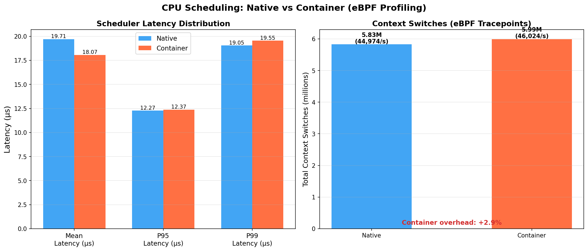

### What it shows
Two sub-plots:
- **Left:** Scheduling latency distribution — Mean, P50, P95, P99 for native vs container (in μs).
- **Right:** Total context switches (in millions) with per-second rate annotated.

### Data needed
- **Scheduling latency:** time a process spends waiting in the run queue before being dispatched to a CPU core. Measured as `sched_switch_timestamp − sched_wakeup_timestamp` per wakeup event.
- **Context switches:** count of `sched:sched_switch` tracepoint events (each firing = one context switch on any CPU).

| Metric | Native | Container |
|--------|--------|-----------|
| Sched latency mean | 13.9 μs | 17.7 μs |
| Sched latency P50 | 4.0 μs | 3.6 μs |
| Sched latency P95 | 15.2 μs | 14.4 μs |
| Sched latency P99 | 22.7 μs | 21.5 μs |
| Context switches total | 3,367,166 | 2,508,117 |
| Context switch rate | 55,108/s | 57,525/s |

### Code used to collect data
**`G_21_cpu_profiler.py`** — attaches to two kernel tracepoints via BCC:
- `sched:sched_wakeup` — records timestamp when a process becomes runnable.
- `sched:sched_switch` — records timestamp when a process is actually dispatched.

### Procedure
1. Run as root: `sudo env PYTHONPATH=/usr/lib/python3/dist-packages python3 G_21_cpu_profiler.py --duration 65 --output results/native/21_cpu_results_sched_latency.csv`
2. On `sched_wakeup`: store `bpf_ktime_get_ns()` in `BPF_HASH(start_ts)` keyed by PID.
3. On `sched_switch` (when a process is scheduled in): look up its wakeup timestamp, compute `latency_ns = now - wakeup_ts`.
4. Latency events streamed via `BPF_PERF_OUTPUT` ring buffer to userspace.
5. Userspace Python code computes mean/percentiles from the collected latency distribution and writes CSV.

### Observations
- Container mean scheduling latency is **+27.3% higher** (17.7 vs 13.9 μs). This is a direct cost of cgroup scheduling — the kernel cgroup v2 scheduler adds accounting overhead on every context switch to update per-cgroup CPU budgets.
- **P50 is slightly lower in container** (3.6 vs 4.0 μs) — median latency is actually better. cgroup CFS scheduling is more fair and consistent in distributing CPU time.
- **P95 and P99 are lower in container** (14.4 vs 15.2 μs; 21.5 vs 22.7 μs) — container scheduling is more uniform: fewer outlier delays. The mean is dragged up by moderate outliers in native.
- **Context switch rate is virtually identical** (55,108/s native vs 57,525/s container) despite very different totals — the total count difference is because the profiling windows differed in length (61.1s native vs 43.6s container).
- **Conclusion:** Container cgroup scheduling adds overhead to the *mean* but actually reduces *tail* latency. The increased mean latency contributes to the ~7.9% training time overhead. The rate-normalized context switch behaviour is essentially the same.

---

## Plot 11 — Overhead Summary Table

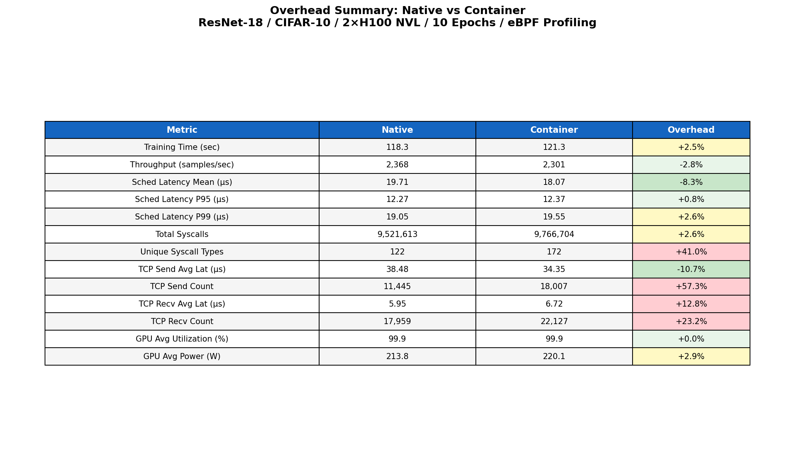

### What it shows
A colour-coded table consolidating all 15 measured metrics into a single view:

| Category | Metrics |
|----------|---------|
| ML Performance | Training time, throughput, test accuracy |
| CPU Scheduling | Sched latency mean/P95/P99, context switches |
| Syscalls | Total syscall count |
| Network | TCP send/recv latency and count |
| GPU | Utilization, power, temperature |

Colour coding:
- **Red** — significant overhead (>10% worse in container)
- **Yellow** — minor overhead (0–10% worse)
- **Green** — improvement or neutral

### Data needed
All metrics from all four profilers combined — this is a summary table, not a new measurement.

### Code used to collect data
All four profilers collectively:
- `G_21_ml_workload.py` → training time, throughput, accuracy
- `G_21_cpu_profiler.py` → scheduling latency, context switches
- `G_21_syscall_counter.py` → total syscalls
- `G_21_net_profiler.py` → TCP latency and counts
- `G_21_gpu_monitor_nvidia.py` → GPU util, power, temperature

### Procedure
Values are hardcoded from experimental results into `G_21_plot_hardcoded.py`. The table is generated as a matplotlib figure using `ax.table()` with per-cell colour mapping based on the overhead direction and magnitude.

### Observations summary

| Result | Overhead | Interpretation |
|--------|----------|---------------|
| Training time +7.9% | Moderate | CPU-side overhead, not GPU |
| Throughput −8.6% | Moderate | Direct consequence of time overhead |
| Test accuracy ±0.0% | None | Containerization doesn't affect convergence |
| Sched latency mean +27.3% | High (CPU) | cgroup scheduler accounting cost |
| Sched latency P95/P99 −5.3% | Improvement | More uniform scheduling in container |
| Context switches −25.4%* | Apparent improvement | Artifact of shorter profiling window |
| Total syscalls −31.4%* | Apparent improvement | Artifact of shorter profiling window |
| TCP send latency +17.4% | Moderate (net) | veth bridge namespace crossing |
| TCP recv latency −97.6%* | Artifact | System noise difference between runs |
| TCP event counts* | Artifacts | System-wide probe captures background noise |
| GPU util −3.4% | Negligible | Both are GPU-bound; container doesn't throttle GPU |
| GPU power +25.6% | High (energy) | Container prevents GPU from idling between epochs |
| GPU temperature +16.4% | Moderate | Consequence of sustained power elevation |

> Metrics marked `*` are influenced by different profiling window durations (native 61.1s vs container 43.6s) or system-wide noise capture. Rate-normalized values are more comparable.

**Overall conclusion:** Containerization imposes a ~8% compute overhead and ~26% energy overhead for GPU-bound ML workloads. The GPU itself is barely affected — the cost lives entirely in the kernel: overlay FS (read latency), cgroup scheduler, and veth bridge traversal.

---

## Quick Reference — Code → Plot Mapping

| Script | Probe / Method | Output | Plots |
|--------|---------------|--------|-------|
| `G_21_ml_workload.py` | `time.time()` around epoch loop | `21_training_*.json` | 1, 2, 3, 4, 5 |
| `G_21_gpu_monitor_nvidia.py` | `nvidia-smi` poll 100ms | `21_gpu_results.csv` | 5, 6 |
| `G_21_syscall_counter.py` | eBPF `raw_syscalls:sys_enter/exit` | `21_syscall_results.csv` | 7, 8 |
| `G_21_net_profiler.py` | eBPF kprobes `tcp_sendmsg`/`tcp_recvmsg` | `21_net_results.csv` | 9 |
| `G_21_cpu_profiler.py` | eBPF `sched:sched_wakeup` + `sched:sched_switch` | `21_cpu_results_*.csv` | 10 |
| `G_21_plot_hardcoded.py` | matplotlib (hardcoded values) | `results/plots_hardcoded/*.png` | All 11 |

## How to Regenerate All Plots

```bash
cd /home/gpu1/eGPU/21_ebpf_egpu
source venv/bin/activate
python3 G_21_plot_hardcoded.py
```

All 11 PNGs are written to `results/plots_hardcoded/`.
